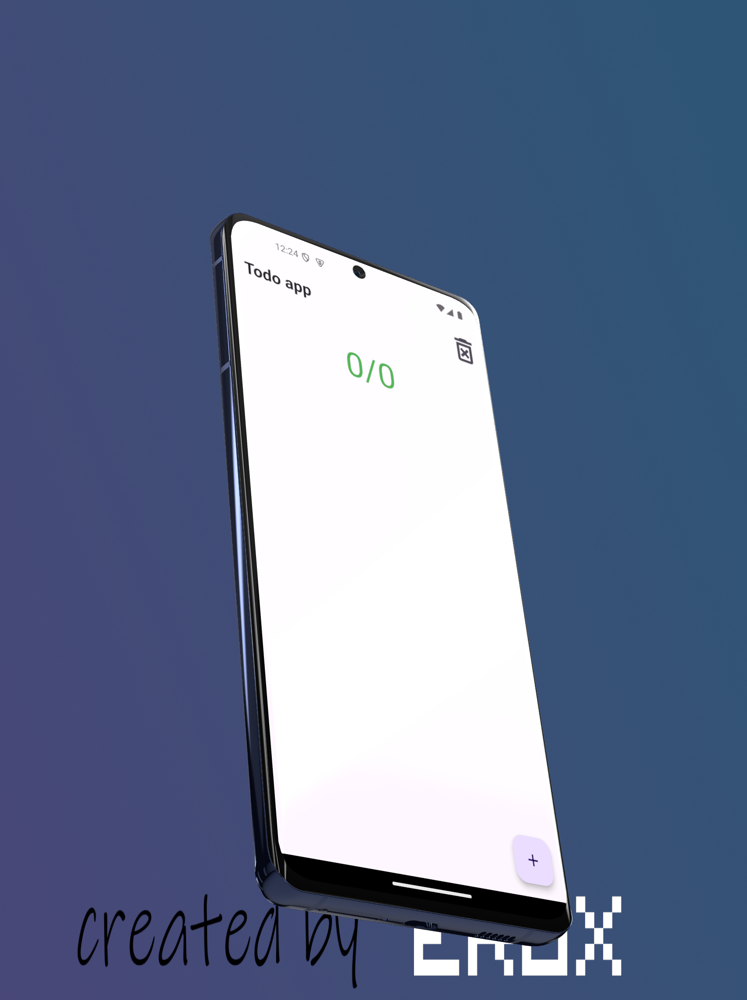
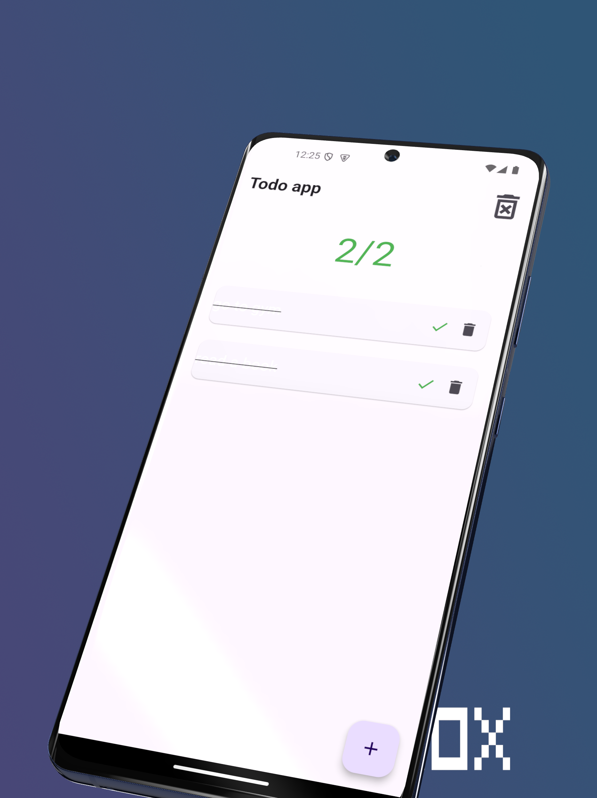
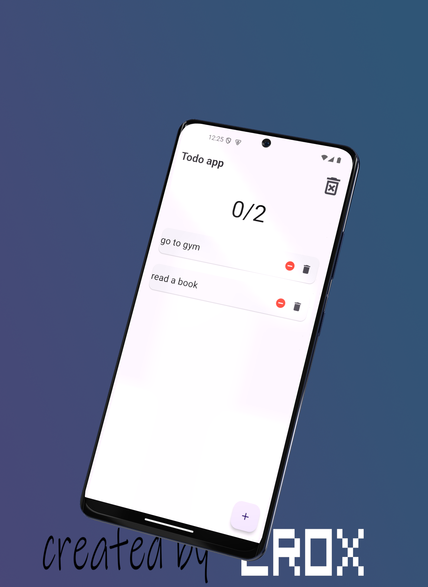
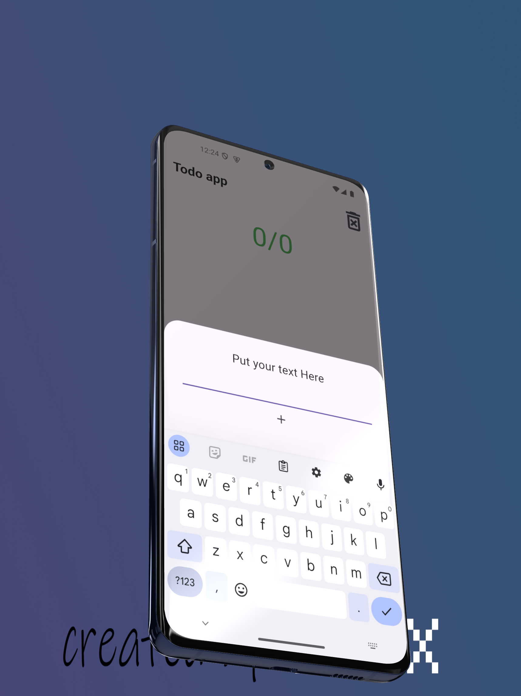

## Flutter TODO List Application UI Design 2


<br>

## Development Setup
Clone the repository and run the following commands:
```
flutter pub get
flutter run
```

## ScreenShot

&nbsp;
;
&nbsp;
;
